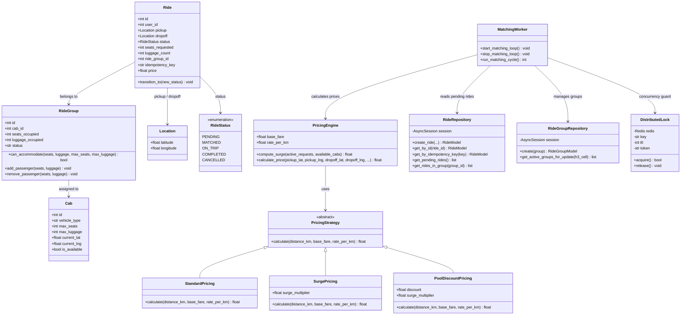

# Smart Airport Ride Pooling Backend

A production-grade backend system that groups airport passengers into shared cabs, optimising routes and pricing while handling real-time cancellations and high concurrency.

---

## Tech Stack

| Layer            | Technology                                   |
| ---------------- | -------------------------------------------- |
| Language         | Python 3.9+                                  |
| API Framework    | FastAPI (async)  |
| ORM              | SQLAlchemy 2.0 (async) + GeoAlchemy2         |
| Database         | PostgreSQL 16 + PostGIS 3.4                  |
| Cache / Locks    | Redis 7                                      |
| Spatial Indexing  | H3 (Uber's hexagonal grid, resolution 7)     |
| Migrations       | Alembic                                      |
| Containerisation | Docker Compose                               |
| Testing          | pytest + pytest-asyncio + httpx               |

---

## Architecture

### High-Level Architecture (HLD)

```
┌─────────────────────────────────────────────────────────────────┐
│                        Client / Postman                         │
└─────────────────────────┬───────────────────────────────────────┘
                          │  HTTP (REST)
┌─────────────────────────▼───────────────────────────────────────┐
│                      API Layer (FastAPI)                         │
│  POST /rides · GET /rides/:id · PATCH /rides/:id/cancel         │
│  GET /admin/active-groups · GET /admin/health                   │
│  ┌────────────┐  ┌──────────────┐                               │
│  │Rate Limiter│  │Idempotency   │                               │
│  │(slowapi)   │  │Guard         │                               │
│  └────────────┘  └──────────────┘                               │
└─────────────────────────┬───────────────────────────────────────┘
                          │
       ┌──────────────────┼──────────────────┐
       ▼                  ▼                  ▼
┌─────────────┐  ┌────────────────┐  ┌──────────────────┐
│  Repository │  │ Pricing Engine │  │ Matching Worker  │
│  Pattern    │  │ (Strategy)     │  │ (Background Task)│
│             │  │                │  │ Redis Lock       │
│             │  │ • Standard     │  │ H3 Spatial Bins  │
│             │  │ • Surge        │  │ Greedy Grouping  │
│             │  │ • Pool Disc.   │  │ Detour Check     │
└──────┬──────┘  └────────────────┘  └────────┬─────────┘
       │                                       │
       ▼                                       ▼
┌──────────────────────┐            ┌────────────────────┐
│  PostgreSQL + PostGIS│            │       Redis        │
│  • users             │            │  • Distributed Lock│
│  • cabs              │            │  • (Future: cache) │
│  • rides             │            └────────────────────┘
│  • ride_groups       │
│  GIST spatial indexes│
└──────────────────────┘
```

### Design Patterns Used (LLD)

| Pattern       | Where                  | Why                                               |
| ------------- | ---------------------- | ------------------------------------------------- |
| **Strategy**  | `PricingEngine`        | Swap pricing algorithms (Standard / Surge / Pool)  |
| **State**     | `Ride.transition_to()` | Enforce valid lifecycle: PENDING→MATCHED→ON_TRIP→COMPLETED/CANCELLED |
| **Repository**| `RideRepository` etc.  | Abstract DB access; enables SQLite tests           |

### Class Diagram



---

## Algorithm — Windowed Spatial Batching

### Steps

1. **Spatial Binning** — Map each pending ride's pickup to an H3 hexagonal cell (resolution 7 ≈ 5.16 km²). Only rides in the same cell are candidates for pooling.

2. **Temporal Batching** — Buffer ride requests for a configurable window (default 15 s). This lets the engine find better global matches instead of greedily matching on arrival.

3. **Greedy Grouping** — For each H3 cell:
   - Iterate pending rides in FIFO order.
   - For each ride, try to add it to an existing group if:
     - **Seats**: `group.seats_occupied + ride.seats_requested ≤ cab.max_seats`
     - **Luggage**: `group.luggage_occupied + ride.luggage_count ≤ cab.max_luggage`
     - **Detour**: for every passenger (existing + new):
       `shared_leg_distance ≤ (1 + DETOUR_TOLERANCE) × direct_distance`
   - If no group fits, create a new group and assign the next available cab.

### Complexity Analysis

| Phase            | Complexity                        | Notes                              |
| ---------------- | --------------------------------- | ---------------------------------- |
| Spatial Binning  | O(N)                              | One H3 call per ride               |
| Greedy Grouping  | Σ O(m_i × g_i × k_i)             | m=rides, g=groups, k=passengers in group (for detour) |
| **Worst case**   | O(N²)                             | All rides in one cell, no matches  |
| **Expected**     | O(N × G_avg)                      | G_avg ≪ N with spatial binning     |

> **Note:** The greedy heuristic does NOT guarantee global minimisation of total travel deviation. An exact solution would require integer programming (NP-hard). The greedy approach is chosen for manageable runtime.

### Detour Model

```
shared_leg(passenger_i) = Σ haversine(stop[j], stop[j+1])
                          for j from pickup_index(i) to dropoff_index(i)

Constraint: shared_leg(i) ≤ (1 + 0.4) × haversine(pickup_i, dropoff_i)
```

Stops are ordered: all pickups first (in arrival order), then all drop-offs.

---

## Dynamic Pricing Formula

```
Price = (Base_Fare + Distance_km × Rate_Per_KM) × Surge_Multiplier × (1 - Pooling_Discount)
```

| Parameter         | Value / Rule                                            |
| ----------------- | ------------------------------------------------------- |
| Base_Fare         | ₹50 (configurable via `.env`)                           |
| Rate_Per_KM       | ₹15/km (configurable)                                   |
| Surge_Multiplier  | `clamp(active_requests / available_cabs, 1.0, 3.0)`     |
| Pooling_Discount  | 0% for 1st passenger, 20% for 2nd, 30% for 3rd+         |

Distance is computed using the **Haversine formula** (great-circle distance).

---

## Database Schema & Indexing

### Tables

```sql
users       (id PK, name, email UNIQUE, rating, created_at)
cabs        (id PK, vehicle_type ENUM, max_seats, max_luggage, current_location GEOMETRY, is_available, created_at)
rides       (id PK, user_id FK→users, pickup_point GEOMETRY, dropoff_point GEOMETRY,
             pickup_lat, pickup_lng, dropoff_lat, dropoff_lng,
             status ENUM, seats_requested, luggage_count,
             ride_group_id FK→ride_groups, idempotency_key UNIQUE, price, created_at, updated_at)
ride_groups (id PK, cab_id FK→cabs, seats_occupied, luggage_occupied, status, h3_cell, created_at, updated_at)
```

### Indexes

| Index                   | Type    | Column(s)          | Purpose                                   |
| ----------------------- | ------- | ------------------- | ----------------------------------------- |
| `idx_cabs_location`     | GIST    | `current_location`  | Find nearest available cabs               |
| `idx_rides_pickup`      | GIST    | `pickup_point`      | Spatial queries on pickup locations        |
| `idx_rides_dropoff`     | GIST    | `dropoff_point`     | Spatial queries on drop-off locations      |
| `idx_rides_status`      | B-Tree  | `status`            | Fast filter for PENDING rides (matching)   |
| `idx_rides_user`        | B-Tree  | `user_id`           | User's ride history                       |
| `idx_rides_group`       | B-Tree  | `ride_group_id`     | Rides in a group (cancellation flow)       |
| `idx_rides_idempotency` | B-Tree  | `idempotency_key`   | Duplicate request prevention               |
| `idx_ride_groups_status`| B-Tree  | `status`            | Active groups for matching                 |
| `idx_ride_groups_cell`  | B-Tree  | `h3_cell`           | Per-cell queries by matching engine        |
| `idx_cabs_available`    | B-Tree  | `is_available`      | Available cab lookup                       |

---

## Concurrency Handling Strategy

| Mechanism                 | Where                  | What It Prevents                        |
| ------------------------- | ---------------------- | --------------------------------------- |
| **Redis Distributed Lock**| Matching worker        | Two workers running the same cycle      |
| **SELECT … FOR UPDATE**   | `ride_groups` table    | Over-booking seats during parallel adds |
| **Idempotency Keys**      | `POST /rides`          | Double-booking on network retries       |
| **Async Connection Pool** | SQLAlchemy engine      | Pool of 20+10 connections for 100 RPS   |

---

## Quick Start

### Prerequisites

- Docker & Docker Compose
- Python 3.9+

### One-liner setup + run

```bash
./setup.sh      # installs everything, runs migrations, seeds data
./start.sh      # starts the server → http://localhost:8000/docs
```

To run the test suite (no Docker needed):

```bash
./test.sh
```

That's it. Open **http://localhost:8000/docs** (Swagger UI) to explore and test every endpoint interactively.

---

### Manual Steps (alternative)

<details>
<summary>Click to expand manual setup</summary>

**1. Start infrastructure**

```bash
docker compose up -d
```

**2. Create virtual environment and install**

```bash
python3 -m venv venv
source venv/bin/activate
pip install -r requirements.txt
```

**3. Run migrations**

```bash
alembic upgrade head
```

**4. Seed sample data**

```bash
python seed.py
```

Creates 10 users, 15 cabs, 2 pre-matched ride groups, and 8 sample rides (PENDING + MATCHED + COMPLETED).

**5. Start the server**

```bash
python main.py
```

Server runs at `http://localhost:8000`.

- **Swagger UI**: http://localhost:8000/docs
- **ReDoc**: http://localhost:8000/redoc

The background matching worker starts automatically and runs every 15 seconds.

**6. Run tests**

```bash
pytest -v
```

</details>

Tests use in-memory SQLite — no Docker required.

---

## API Endpoints

| Method | Path                            | Description                     | Status |
| ------ | ------------------------------- | ------------------------------- | ------ |
| POST   | `/api/v1/rides`                 | Create a ride request           | 202    |
| GET    | `/api/v1/rides/{ride_id}`       | Get ride status and price       | 200    |
| PATCH  | `/api/v1/rides/{ride_id}/cancel`| Cancel a ride                   | 200    |
| GET    | `/api/v1/admin/active-groups`   | List active groups with rides   | 200    |
| GET    | `/api/v1/admin/health`          | Health check                    | 200    |

### Example: Create a Ride

```bash
curl -X POST http://localhost:8000/api/v1/rides \
  -H "Content-Type: application/json" \
  -d '{
    "user_id": 1,
    "pickup_lat": 19.0896,
    "pickup_lng": 72.8656,
    "dropoff_lat": 19.1176,
    "dropoff_lng": 72.8490,
    "seats_requested": 1,
    "luggage_count": 1,
    "idempotency_key": "abc-123"
  }'
```

Response (202):
```json
{
  "id": 9,
  "user_id": 1,
  "pickup_lat": 19.0896,
  "pickup_lng": 72.8656,
  "dropoff_lat": 19.1176,
  "dropoff_lng": 72.849,
  "status": "PENDING",
  "seats_requested": 1,
  "luggage_count": 1,
  "ride_group_id": null,
  "price": null,
  "created_at": "2026-02-15T12:00:00Z"
}
```

After the matching worker runs (~15 s), `GET /api/v1/rides/9` will show `status: "MATCHED"` with a calculated `price`.

---

## Assumptions

1. **Distance model**: Haversine (great-circle) distance is used instead of road routing. In production this would be replaced by an OSRM or Google Maps routing client.
2. **Matching SLA**: Rides are matched within 15 seconds (configurable via `MATCHING_INTERVAL_SECONDS`).
3. **Airport context**: All pickups are near the airport; H3 resolution 7 cells (~5.16 km²) are appropriate for this zone.
4. **Detour tolerance**: 40% max detour per passenger (configurable via `DETOUR_TOLERANCE`).
5. **Cab assignment**: The first available cab is assigned to a new group (FIFO). In production, nearest-cab assignment using PostGIS spatial queries would be used.
6. **10K concurrent users**: Handled by design — stateless API behind a load balancer, Redis caching, PostgreSQL read replicas. Documented but not load-tested in local demo.

---

## Scaling to 10,000 Concurrent Users

| Concern              | Strategy                                                   |
| -------------------- | ---------------------------------------------------------- |
| API throughput        | Stateless FastAPI; run N replicas behind a load balancer    |
| Database reads        | PostgreSQL read replicas for user profiles and ride status  |
| Database writes       | Connection pooling (20+10 overflow); write to primary only  |
| Matching bottleneck   | Per-H3-cell Redis locks allow parallel matching workers     |
| Caching               | Redis cache for cab locations and ride prices               |
| Rate limiting         | 100 req/min per client IP (SlowAPI)                        |

---

## Project Structure

```
├── main.py                    # Entry point (uvicorn)
├── src/
│   ├── config.py              # Pydantic settings from .env
│   ├── domain/                # Pure business logic (no DB)
│   │   ├── enums.py           # RideStatus, VehicleType
│   │   ├── entities.py        # Ride (state machine), Cab, RideGroup
│   │   ├── distance.py        # Haversine formula
│   │   ├── pricing.py         # Strategy pattern pricing engine
│   │   └── matching.py        # Spatial batching + greedy grouping
│   ├── infrastructure/        # DB, Redis, external services
│   │   ├── database.py        # Async SQLAlchemy engine
│   │   ├── models.py          # ORM models (PostGIS geometry)
│   │   ├── repositories.py    # Repository pattern
│   │   ├── redis_client.py    # Redis connection pool
│   │   └── locks.py           # Distributed lock
│   ├── api/                   # HTTP interface
│   │   ├── app.py             # FastAPI factory + lifespan
│   │   ├── schemas.py         # Pydantic request/response models
│   │   ├── dependencies.py    # DB session injection
│   │   ├── middleware.py       # Rate limiter
│   │   └── routes/
│   │       ├── rides.py       # CRUD ride endpoints
│   │       └── admin.py       # Observability endpoints
│   └── workers/
│       └── matcher.py         # Background matching loop
├── migrations/                # Alembic (PostGIS + all tables)
├── tests/                     # 47 tests (unit + integration)
├── seed.py                    # Sample data loader
├── docker-compose.yml         # PostgreSQL + Redis
├── Dockerfile                 # App container
├── requirements.txt           # Python dependencies
└── .env.example               # Environment template
```

---

## Test Summary

| File                    | Tests | Covers                                   |
| ----------------------- | ----- | ---------------------------------------- |
| `test_pricing.py`       | 12    | Strategy pattern, surge, pool discounts   |
| `test_matching.py`      | 10    | Haversine, H3 cells, detour checks        |
| `test_ride_state.py`    | 10    | State machine transitions (valid+invalid) |
| `test_api.py`           | 8     | All endpoints, idempotency, cancel flow   |
| `test_concurrency.py`   | 7     | Capacity guards, distributed lock         |
| **Total**               | **47**| Domain + API + Concurrency               |

Run all: `pytest -v`

---

## How to Run 

### Prerequisites

You need two things installed:

- **Docker Desktop** (or any Docker runtime) -- runs PostgreSQL + Redis
- **Python 3.9+**

### Steps

```bash
git clone <repo-url>
cd <repo-folder>
./setup.sh      # ~60s: starts Docker, creates venv, installs deps, runs migrations, seeds data
./start.sh      # starts the server
```

Open **http://localhost:8000/docs** -- this is the interactive Swagger UI where you can test every endpoint.

### What to try

| Action | How | What to expect |
|--------|-----|----------------|
| See seeded data | `GET /api/v1/rides/1` | Returns a MATCHED ride with price |
| See active groups | `GET /api/v1/admin/active-groups` | 2 groups with pooled rides |
| Create a ride | `POST /api/v1/rides` with `{"user_id": 9, "pickup_lat": 19.0896, "pickup_lng": 72.8656, "dropoff_lat": 19.076, "dropoff_lng": 72.8777, "seats_requested": 1, "luggage_count": 1}` | Returns 202 with status PENDING |
| Watch matching | Wait 15s, then `GET /api/v1/rides/{id}` | Status changes to MATCHED, price is calculated |
| Cancel a ride | `PATCH /api/v1/rides/6/cancel` | Returns CANCELLED, group capacity freed |
| Cancel again | `PATCH /api/v1/rides/6/cancel` | Returns 409 Conflict (state machine) |
| Test idempotency | POST same ride twice with `"idempotency_key": "abc"` | Same ride ID both times |
| Run tests | `./test.sh` | 47 tests pass (no Docker needed) |
